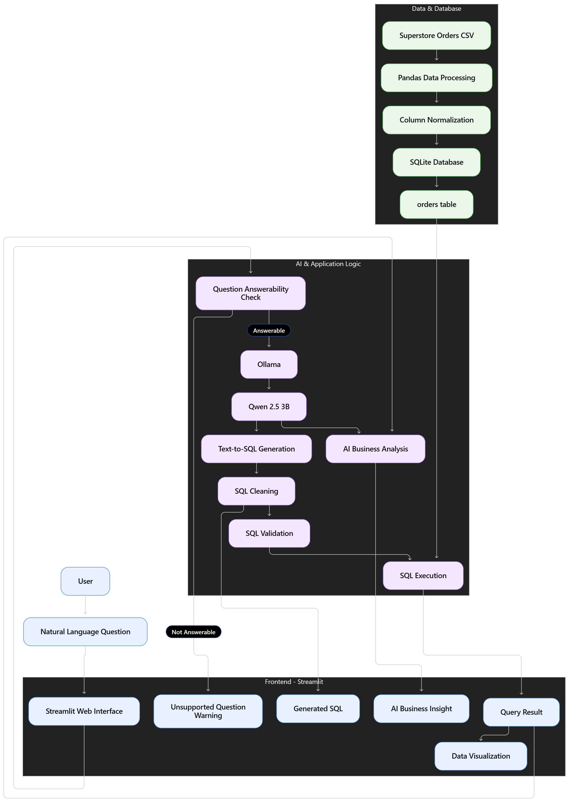
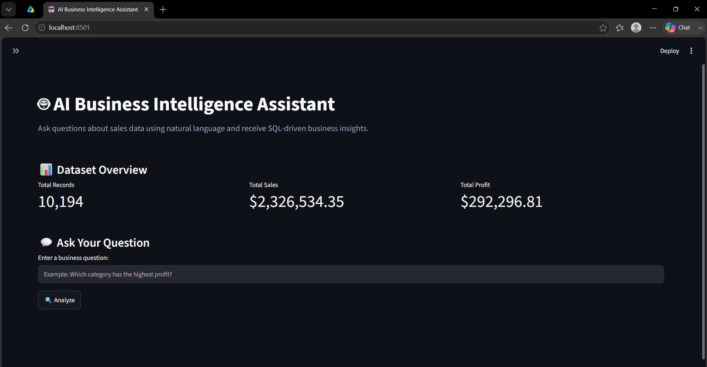
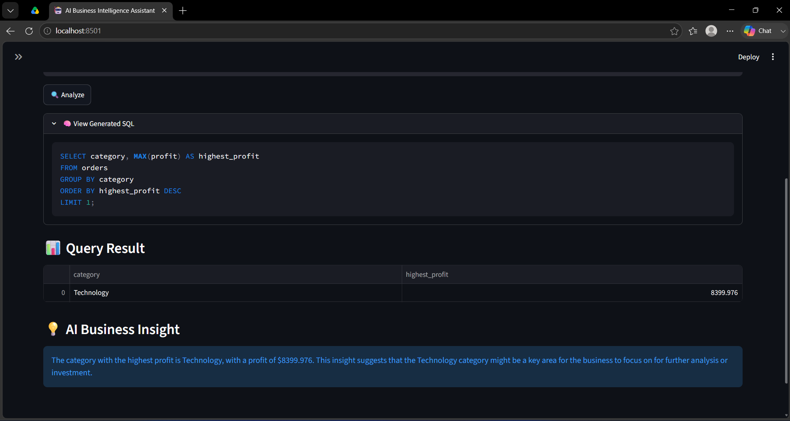
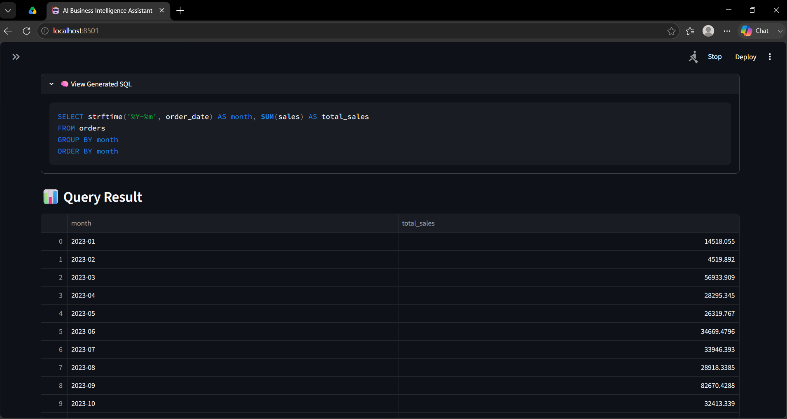
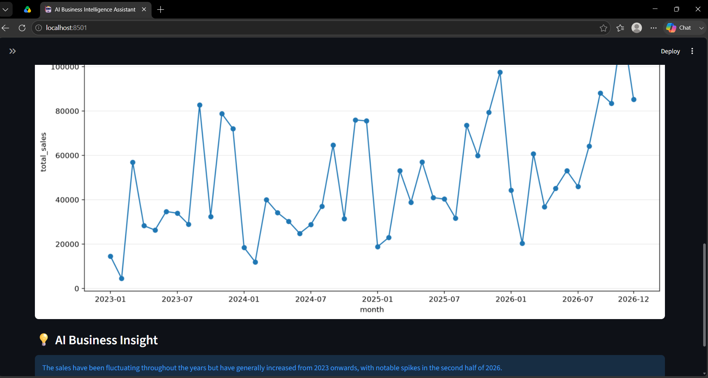

# 🚀 AI Business Intelligence Assistant

[🎥 Project Demo](assets/AI-Business-Intelligence-Assistant-demo.gif)

An AI-powered Business Intelligence application that allows users to ask questions about structured sales data using natural language. The system uses a locally hosted **Qwen 2.5 3B Large Language Model** through **Ollama** to convert business questions into SQL, execute the generated queries against a SQLite database, visualize the results, and provide concise AI-generated business insights.

---

## Objective

The objective of this project is to build a local AI-powered Business Intelligence assistant that allows non-technical users to interact with business data using natural language.

The system converts user questions into SQL, validates and executes the generated queries, visualizes the results, and generates concise business insights.

The project was evaluated on a 30-question benchmark and achieved **96.7% overall accuracy**, with an average AI response time of **8.45 seconds**. Based on an estimated 2-minute manual SQL baseline, the system demonstrates a potential **~93% reduction in response time for routine business queries**.

---

## 💡 Business Problem

Data Analysts often spend a significant amount of time answering repetitive, frequently asked questions from clients or business owners, such as sales by category, regional performance, or monthly trends. Since many clients are not familiar with SQL, they depend on analysts even for simple data queries. This project solves this problem by providing an AI-powered interface where clients can ask these frequently asked questions in natural language and receive data-driven answers, visualizations, and business insights. This reduces repetitive workload for data analysts, allowing them to focus more time on complex analysis and higher-value business tasks.

---

## 💡 Why I Built This (Project Purpose)

I built this project to combine **Generative AI, SQL, data analytics, and Business Intelligence** into one practical application.

My goal was to understand how Large Language Models can be integrated with structured business data to create a natural-language interface for analytics, while ensuring that the actual business calculations are performed by the database rather than relying on the LLM to calculate results directly.

Through this project, I explored **Text-to-SQL, prompt engineering, local LLM deployment, SQL validation, data visualization, and AI-assisted business analysis**.

---

## 💡 What this project demonstrates

Generative AI: Local Qwen 2.5 3B integration
Text-to-SQL: Natural language → executable SQL
Data Analytics: SQL + Pandas + business KPIs
Business Intelligence: Automated charts and insights
Data Engineering: CSV → transformation → SQLite
AI Safety: Read-only SQL validation
Application Development: Interactive Streamlit interface

---

## 🛠️ Tech Stack & Architecture Choice

- **Python**: Chosen as the primary development language because of its strong ecosystem for AI, data analysis, and visualization.
- **Qwen 2.5 3B**: A lightweight pretrained Large Language Model used for natural-language understanding, Text-to-SQL generation, and business insight generation.
- **Ollama**: Used to run Qwen locally without depending on a paid external LLM API.
- **SQLite**: Chosen as a lightweight relational database for storing and querying the structured Superstore dataset.
- **Pandas**: Used for data loading, cleaning, column-name normalization, and result processing.
- **Streamlit**: Used to build the interactive web application in Python.
- **Matplotlib**: Used to generate categorical and time-series visualizations.

### Architecture


---

## 🌟 Key Features & Accomplishments

- **Natural-Language Analytics:** Users can ask business questions without writing SQL manually.
- **AI-Powered Text-to-SQL:** Qwen converts natural-language questions into SQLite-compatible SQL queries.
- **Schema-Aware Prompting:** The LLM receives the database schema and explicit column mappings to reduce incorrect column-name generation.
- **Read-Only SQL Safety:** Generated queries are validated before execution, with database modification commands rejected.
- **SQLite Query Execution:** Validated SQL is executed against the structured sales database to obtain the actual business result.
- **Automatic Visualization:** Query results are automatically visualized when appropriate.
- **Time-Series Analysis:** Monthly sales and profit questions are displayed using line charts with readable time-axis labels.
- **AI Business Insights:** The LLM summarizes returned database results into concise business observations.
- **Local AI Processing:** Qwen runs locally through Ollama, so the application does not require a paid external LLM API key.

---

## Performance & Evaluation

The AI Business Intelligence Assistant was evaluated using a **30-question benchmark** covering supported business queries, unsupported questions, and natural-language variations.

### Benchmark Results

| Metric | Result |
|---|---:|
| Supported business questions | **20/20 (100%)** |
| Unsupported-question detection | **4/5 (80%)** |
| Natural-language / edge questions | **5/5 (100%)** |
| Overall benchmark accuracy | **29/30 (96.7%)** |
| Average AI response time | **8.45 seconds** |
| Minimum response time | **4.87 seconds** |
| Maximum response time | **46.22 seconds** |

The benchmark evaluates whether the system can correctly understand business questions, generate valid SQL, execute the query against the database, and return the expected analytical result.

### Estimated Business Impact

To estimate the potential efficiency benefit for routine business queries, the measured AI response time was compared with an estimated **2-minute manual SQL analysis baseline**.

- Estimated manual SQL response time: **120 seconds/query**
- Average AI response time: **8.45 seconds/query**
- Estimated time saved: **111.55 seconds/query**
- Estimated response-time reduction: **~93%**

Using the same baseline, answering 20 routine business questions could represent approximately **37 minutes of analyst time saved**.

> **Note:** The 2-minute manual baseline is an estimate rather than a controlled measurement. The AI response time and benchmark accuracy are measured results from the project evaluation.

Detailed benchmark results are available in [`benchmark/results.csv`](benchmark/results.csv).
---

## 📸 Core Walkthrough / Demo

### 🎥 Project Demo

[▶️ Watch the Project Demo](assets/demo.mp4)

### 1. Natural Language Query

Users can ask business questions without writing SQL.

---

### 2. AI-Generated SQL

Qwen 2.5 3B converts the natural-language question into SQL.



---
### 3. Query Results & Visualization

The validated SQL query is executed against the SQLite database and the
results are automatically visualized.



---
### 4. AI-Generated Business Insight

The LLM analyzes the returned data and provides a concise business insight.




Example questions demonstrated by the application include:

- Which category has the highest profit?
- Which customer segment has the highest profit?
- What are the monthly sales?

---

## 🚀 Getting Started & Installation

### Prerequisites

- Python 3.10+
- Ollama
- Git

### 1. Clone the repository

```bash
git clone https://github.com/sreeramshruti-30523/AI-Business-Intelligence-Assistant.git
```

```bash
cd AI-Business-Intelligence-Assistant
```

### 2. Create a virtual environment

```bash
python -m venv venv
```

Activate the environment according to your operating system.

### 3. Install dependencies

```bash
pip install -r requirements.txt
```

### 4. Download the Qwen model

```bash
ollama pull qwen2.5:3b
```

### 5. Run the application

```bash
streamlit run app.py
```

The application will open in your browser.

---

## 🧠 Key Learnings & Challenges Solved

### Challenge 1: CSV Encoding

**Problem:** The source CSV contained characters that could not be decoded using UTF-8.

**Solution:** Loaded the dataset using `cp1252` encoding.

**What I learned:** Real-world datasets can contain encoding inconsistencies, so data ingestion needs to account for the source file's character encoding.

---

### Challenge 2: Incorrect LLM-Generated Column Names

**Problem:** The LLM occasionally generated column names that did not exist in the database, such as interpreting "customer segment" as `customer_segment` instead of the actual `segment` column.

**Solution:** Normalized database column names into lowercase `snake_case` and strengthened the prompt with the actual schema and explicit column mappings.

**What I learned:** LLM-generated SQL should be constrained using the actual database schema instead of relying only on natural-language interpretation.

---

### Challenge 3: Unsafe AI-Generated SQL

**Problem:** An LLM-generated query should not be allowed to modify the database.

**Solution:** Added a validation layer that only permits read-only `SELECT` queries and rejects potentially destructive SQL commands.

**What I learned:** LLM output should be validated before being passed to downstream systems.

---

### Challenge 4: Time-Series Visualization

**Problem:** The initial monthly trend visualization contained too many x-axis labels, making the chart difficult to read.

**Solution:** Used a line chart for time-based results and dynamically reduced the number of displayed x-axis labels while retaining the underlying data points.

**What I learned:** Data visualization should adapt to the structure and scale of the returned dataset.

---

### Challenge 5: Handling Unsupported Questions

**Problem:** During testing, I found that the LLM could generate a valid but unrelated SQL query when users asked for information that was not available in the dataset, such as an employee satisfaction score.

**Solution:** Added a question answerability check before Text-to-SQL generation. The application verifies whether the question relates to information available in the Superstore dataset and rejects unsupported questions before SQL execution.

### Challenge 6: 

- Designed and evaluated a 30-question benchmark to measure Text-to-SQL accuracy, unsupported-question handling, natural-language variations, and response time.
- Improved Text-to-SQL reliability by introducing dimension-locking rules to prevent the model from confusing business dimensions such as category, sub-category, region, and customer segment.
- Added an answerability-check layer to prevent unsupported business questions from being incorrectly converted into SQL.

---

## 🔐 Why Use a Local LLM?

The project uses **Ollama + Qwen 2.5 3B** to run the language model locally rather than depending on a paid external LLM API.

This approach:

1. Avoids requiring a paid API key for local development.
2. Keeps the LLM inference workflow on the local machine.
3. Provides a practical way to experiment with LLM integration at no API cost.

---

## 🛡️ SQL Safety

Because SQL is generated by an LLM, the application validates the generated query before execution.

The current prototype:

- Allows only `SELECT` queries.
- Rejects `INSERT`.
- Rejects `UPDATE`.
- Rejects `DELETE`.
- Rejects `DROP`.
- Rejects `ALTER`.
- Rejects `CREATE`.
- Rejects other database modification/attachment commands.

This provides a basic read-only safety layer between the LLM and the database.

> **Note:** This is a prototype-level validation layer, not a production-grade SQL parser or sandbox.

---

## 📊 Visualization

The application automatically generates a visualization when the query returns suitable numerical data.

### Categorical Analysis

Questions such as:

> Which category has the highest profit?

can produce a categorical bar chart.

### Time-Series Analysis

Questions such as:

> What are the monthly sales?

produce a line chart with the monthly values and a reduced number of x-axis labels for readability.

### Single-Value Queries

For queries that return only a single numerical value, the result is displayed without forcing an unnecessary chart.

---

## ⚠️ Limitations

- The Text-to-SQL model can occasionally generate incorrect SQL for complex or ambiguous questions.
- The current application is designed around the provided Superstore dataset schema.
- Qwen 2.5 3B is a relatively small local model, so complex questions may require stronger prompting or a larger model.
- Automatic visualization selection is based on the structure of the query result.
- The current SQL validation is a prototype-level safety layer rather than a production-grade SQL parser or sandbox.
- The local Ollama setup is intended for running the application on a machine with the required model installed.

---

## 🔮 Future Improvements

- More robust SQL parsing and validation
- Support for multiple datasets and database schemas
- Automatic query correction and retry
- Conversation history and follow-up questions
- Improved automatic chart selection
- Retrieval-Augmented Generation for business documentation
- User authentication
- Cloud deployment with hosted/local model infrastructure
- Support for larger and more capable LLMs
- Query performance monitoring

---

## 📁 Project Structure

```text
AI-Business-Intelligence-Assistant/
│
├── app.py
├── README.md
├── requirements.txt
├── .gitignore
│
├── data/
│   └── superstore_orders.csv
│
├── assets/
│   ├── AI-Business-Intelligence-Assistant-demo.gif
│   └── demo.mp4
│
├── architecture_diagram/
│   └── architecture-diagram.png
│
├── screenshots/
│   ├── 1.png
│   ├── 2.png
│   ├── 3.png
│   ├── 4.png
│   ├── 5.png
│   └── 6.png
│
└── benchmark/
    ├── benchmark.py
    ├── benchmark_questions.csv
    ├── results.csv
    
```
The SQLite database and Python virtual environment are generated/used locally and should not be committed to the repository.

---

## 🎯 Project Objective

The objective of this project is to demonstrate how a Large Language Model can be integrated with structured business data to create a natural-language analytics interface.

Instead of requiring users to manually write SQL, the system translates business questions into SQL, uses the database to perform the actual calculations, visualizes the results, and generates a concise business interpretation.

---

## 📬 Contact & Connect

- **Name:** Shruti Sreeram
- **LinkedIn:** https://www.linkedin.com/in/shruti-sreeram-5b6817258
- **GitHub:** https://github.com/sreeramshruti-30523
- **Email:** sreeramshruti@gmail.com

---

## 👩‍💻 Project

**AI Business Intelligence Assistant**

Built using **Python, Streamlit, SQLite, Qwen 2.5 3B, Ollama, Pandas, and Matplotlib**.
